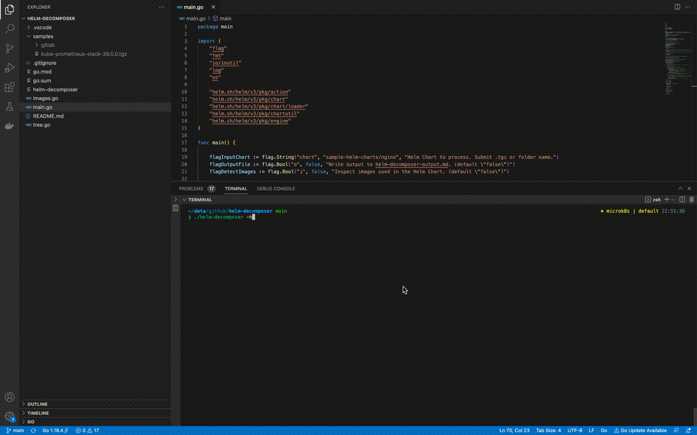

## helm-decomposer
The tool templates the Helm package (.tgz or untarred folder) identifies all images in use and visualizes tree structure of the Chart.

## Demo


## Build the binary
```
git clone git@github.com:jkosik/helm-decomposer.git
cd helm-decomposer
go build .
```

## Usage
1. Download any Helm Chart. You will reference it later on.
2. Run as `./helm-decomposer -chart mychart.tgz -ij -o`
```
❯ ./helm-decomposer -h
Usage of ./helm-decomposer:
  -chart string
        Helm Chart to process. Submit tar.gz or folder name. (default "samples/nginx")
  -o     Write output to helm-decomposer-output.md. (default "false")
  -ij    Write output to images.json. (default "false")
  -iy    Write output to images.yaml. (default "false")
```

## Issues
- Edge case appears when Helm chart uses dependency aliases combined with subchart parametrized on parent level only.

## License
MIT
